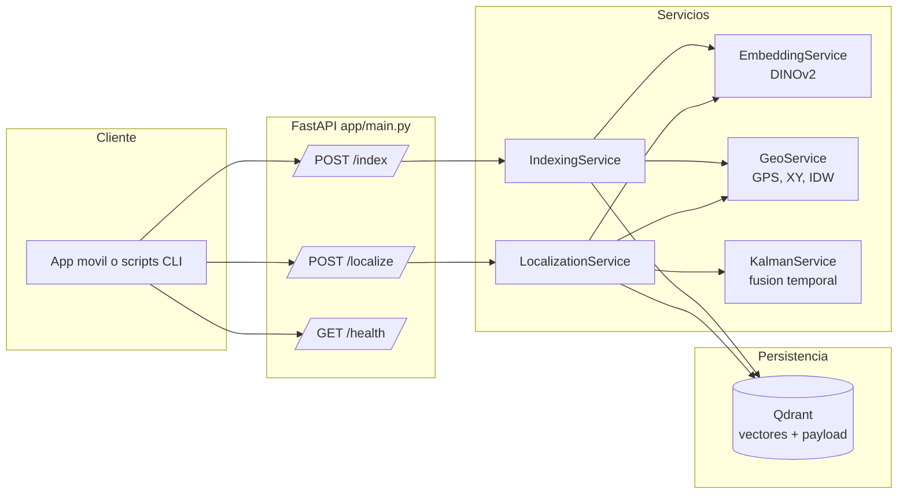
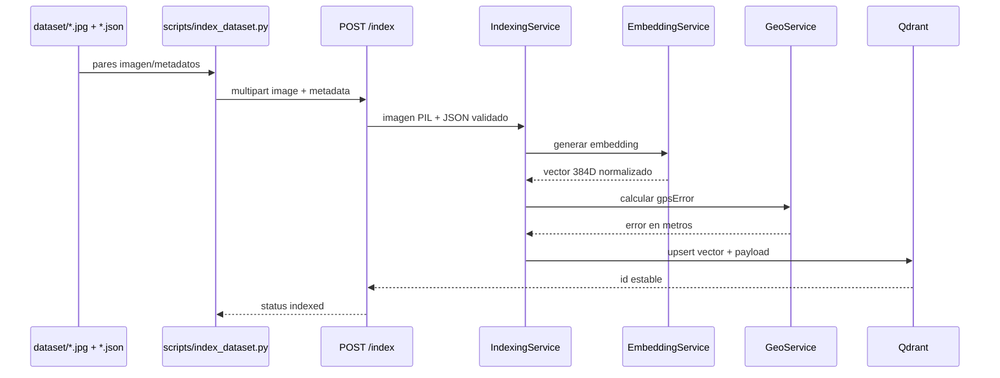
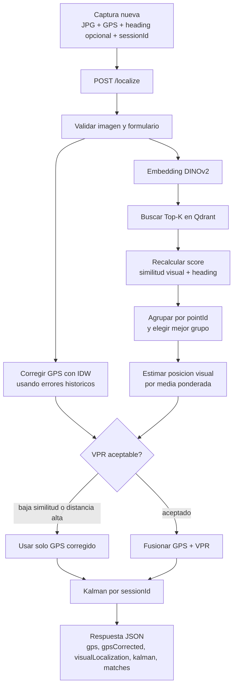

# Prototipo de localización visual del campus

Python + DINOv2 ViT-S/14 + Qdrant + FastAPI. Indexa JPG/JSON de la aplicación existente y fusiona GPS corregido con reconocimiento visual mediante Kalman.

## Arquitectura

El prototipo esta organizado como una API FastAPI con servicios internos especializados. `app/main.py` expone los endpoints, valida archivos y formularios, y delega el trabajo pesado a servicios creados al iniciar la aplicacion. El modelo DINOv2 se carga una sola vez, Qdrant conserva los vectores visuales y sus metadatos, y el estado temporal de cada recorrido vive en memoria dentro de `LocalizationService`.



Responsabilidades principales:

- `EmbeddingService`: prepara la imagen JPG, ejecuta DINOv2 y devuelve un embedding visual normalizado.
- `QdrantService`: crea/verifica la coleccion, inserta vectores, consulta vecinos visuales Top-K y recorre payloads historicos.
- `IndexingService`: valida el JSON de captura, calcula el error GPS contra la referencia y guarda vector + metadatos.
- `GeoService`: convierte latitud/longitud a coordenadas locales en metros, calcula errores y corrige GPS por IDW.
- `LocalizationService`: combina similitud visual, heading, correccion GPS, reglas de aceptacion VPR y filtro de Kalman por sesion.
- `KalmanService`: mantiene la estimacion `[x, y, vx, vy]` para suavizar la posicion a traves del recorrido.

## Flujo del proyecto

El proyecto tiene dos flujos importantes. Primero se construye la base visual del campus indexando fotos conocidas con su JSON; despues la API puede localizar una captura nueva combinando reconocimiento visual y sensores del telefono.

### 1. Indexacion del dataset



Resultado: Qdrant queda poblado con referencias visuales. Cada punto conserva `pointId`, coordenadas GPS medidas, coordenadas de referencia, heading, bloque, piso, ruta original y metadatos fuente.

### 2. Localizacion de una captura nueva



En cada solicitud, la salida `kalman` es la posicion final recomendada para la aplicacion. `visualLocalization` ayuda a diagnosticar si el reconocimiento visual fue aceptado o rechazado, y `matches` muestra las referencias visuales mas parecidas encontradas en Qdrant.

## Inicio en Windows PowerShell

Requisitos: Python **3.11**, Docker Desktop con motor Linux encendido, conexión a Internet para instalar paquetes y descargar DINOv2 la primera vez. CPU suficiente para el MVP; la instalación local de PyTorch puede aprovechar CUDA si está disponible. El contenedor usa CPU. Ejecute los comandos desde esta carpeta.

```powershell
py -3.11 -m venv .venv
.\.venv\Scripts\python.exe -m pip install --upgrade pip
.\.venv\Scripts\python.exe -m pip install -r requirements.txt
Copy-Item .env.example .env
docker compose up -d qdrant
.\.venv\Scripts\python.exe -m uvicorn app.main:app --host 127.0.0.1 --port 8000 --workers 1
```

No necesita activar el entorno virtual. El primer inicio descarga los pesos y el preprocesador del modelo, por lo que tarda más. Espere `Application startup complete`. Si Qdrant no está listo, vuelva a iniciar Uvicorn. Abra http://localhost:8000/docs para probar los campos multipart. `/health` confirma que la API inició; no es una comprobación continua de Qdrant.

En otra ventana PowerShell, desde la misma carpeta:

```powershell
Invoke-RestMethod http://localhost:8000/health
# Copie sus archivos reales a dataset/ antes de indexar.
.\.venv\Scripts\python.exe scripts/index_dataset.py
.\.venv\Scripts\python.exe scripts/test_localization.py --image test_images/prueba.jpg --latitude 6.20118 --longitude -75.57853 --heading 80 --session-id recorrido-1
```

Si la foto de prueba trae su JSON real, puede evitar escribir sus coordenadas y heading:

```powershell
.\.venv\Scripts\python.exe scripts/test_localization.py --image "C:\ruta\foto.jpg" --metadata "C:\ruta\foto.json"
```

El script toma del JSON el GPS, heading, `sessionId` y coordenada de referencia. Esta última se usa solamente para calcular las métricas de evaluación; la API no la recibe ni la utiliza para estimar la ubicación. Los argumentos explícitos, si se proporcionan, prevalecen sobre el JSON.

Use el mismo `--session-id` en mediciones sucesivas del mismo recorrido. Sin él, se genera una sesión nueva y se devuelve su identificador. El filtro utiliza tiempo de recepción, no timestamp de captura: para evaluar una secuencia grabada, este MVP no reproduce sus intervalos originales.

## Dataset

```text
dataset/
  Biblioteca_001_N.jpg
  Biblioteca_001_N.json
  Biblioteca_001_E.jpg
  Biblioteca_001_E.json
  Biblioteca_002_N.jpg
  Biblioteca_002_N.json
test_images/
  prueba.jpg
```

Se recorren subcarpetas y se admiten `.jpg`, `.jpeg` y extensiones en mayúsculas. Imagen y JSON deben tener el mismo nombre base. `examples/Biblioteca_001_E.json` contiene el ejemplo completo proporcionado; no se incluye una foto ficticia como referencia real. Las fotos de prueba deben proceder de capturas independientes para evaluar generalización.

Campos obligatorios: `metadata.pointId`, `metadata.coordinates.gps`, `metadata.coordinates.reference`, `metadata.compassHeadingDegrees`. Latitud y longitud deben ser válidas. El heading se normaliza automáticamente módulo 360; por ejemplo, `-112.23°` pasa a `247.77°`. Se preservan calidad, autor, sesión, timestamp y demás campos dentro de `sourceMetadata`. `floor: null` es válido. Fotos del mismo lugar comparten `pointId` y preferiblemente la misma referencia.

`scripts/index_dataset.py` valida metadatos y envía los pares a `/index`, donde se carga la imagen, genera el embedding y guarda el payload. Reporta pares faltantes y errores por archivo; continúa con los demás y devuelve código 1 si hubo errores. Reindexar el mismo contenido y pointId actualiza el registro: el ID UUID deriva del contenido de píxeles y pointId. Cambiar la fotografía crea otro registro; eliminar un JPG local no elimina su registro de Qdrant.

Para una pareja individual en PowerShell:

```powershell
curl.exe -X POST http://localhost:8000/index -F "image=@dataset/Biblioteca_001_E.jpg" -F "metadata=@dataset/Biblioteca_001_E.json"
```

## Docker para ambos servicios

Después de copiar `.env.example` a `.env`, puede usar esta alternativa al Uvicorn local:

```powershell
docker compose up -d --build
docker compose logs -f api
```

Los scripts anteriores siguen funcionando desde el entorno virtual del host. Los datos Qdrant y el caché del modelo persisten en volúmenes. `docker compose down` detiene los servicios y conserva los volúmenes. La API tiene un solo worker para mantener sesiones coherentes. No ejecute simultáneamente la API local y el contenedor en el puerto 8000.

## Interpretación y decisiones

- DINOv2 produce el token CLS de 384 dimensiones, normalizado L2, usando su preprocesador oficial y orientación EXIF. El modelo se carga una vez al iniciar. No incorpora GPS ni heading al vector. Modelo y revisión están fijados; si cambia modelo/preprocesado, cambie colección y reindexe todo.
- Qdrant usa coseno y recupera Top-10 mediante `query_points`. Cada imagen conserva los campos planos solicitados, `imagePath`, `sourceMetadata` y `gpsError`. La ruta representa el nombre original; la API no guarda una copia del JPG.
- Heading: diferencia circular mínima y similitud `1 - diferencia/180`. Con heading, score = `(1-HEADING_WEIGHT)*coseno + HEADING_WEIGHT*similitud_heading`; sin heading usa solo coseno. Se agrupa por pointId y gana la media de scores, evitando favorecer automáticamente puntos con más fotos.
- Dentro del grupo ganador se ponderan posiciones por `max(coseno,0)`; si todos los pesos son cero se usa media uniforme y se rechaza por baja similitud. La confianza es la media ponderada de similitudes visuales, **no una probabilidad calibrada**. La orientación no aumenta esa confianza.
- Coordenadas locales: proyección equirectangular sobre esfera de radio 6 371 008.8 m, con origen configurable. X apunta al este e Y al norte. Es una aproximación para unos pocos kilómetros alrededor del campus; no usar para distancias regionales. Las medias y distancias se calculan en metros.
- `gpsError` es GPS menos referencia; el sesgo corrector tiene signo opuesto. IDW promedia capturas de cada pointId, busca vecinos por su GPS histórico medio, aplica radio máximo y pondera `1/(distancia²+epsilon)`. Sin vecinos devuelve el GPS original. Recorre payloads paginados en cada consulta: sencillo para datasets pequeños. Un sesgo histórico puede variar por equipo, hora y entorno; debe evaluarse con capturas independientes.
- Kalman usa `[x,y,vx,vy]`, velocidad constante y ruido de aceleración. Inicializa con GPS corregido y luego actualiza con VPR aceptado. En solicitudes posteriores predice y fusiona ambas mediciones. `gpsAccuracyMeters` se interpreta como sigma por eje para este MVP; no todos los celulares reportan esa magnitud con esa convención. Valores por defecto y umbrales están en `.env.example`.
- VPR usa sigma 2/4/7 m para confianza ≥0.90/0.80/0.70. Descarta confianza inferior y distancias al GPS corregido superiores a 50 m. `visualLocalization.accepted`, `rejectionReason` y `vprRejectionReason` explican la decisión. La estimación visual rechazada se devuelve para diagnóstico, pero no entra al filtro. Sin referencias visuales disponibles devuelve `null` y continúa con GPS.
- Las sesiones expiran tras 30 minutos de inactividad y hay un máximo de 1000; se elimina la más antigua al alcanzar el límite. Reiniciar el proceso elimina el estado. Un bloqueo protege actualizaciones concurrentes; no hay Redis ni múltiples workers.

Los umbrales son hipótesis iniciales que requieren calibración. El prototipo estima posición; no detecta obstáculos ni constituye un sistema de navegación segura validado para personas con discapacidad visual.

## Evaluación y CSV

```powershell
.\.venv\Scripts\python.exe scripts/test_localization.py --image test_images/prueba.jpg --latitude 6.20118 --longitude -75.57853 --heading 80 --gps-accuracy 8 --session-id recorrido-1 --reference-latitude 6.201160 --reference-longitude -75.578501 --csv results/pruebas.csv
```

Imprime los cuatro errores en metros. Cada ejecución añade una fila al CSV con métricas y respuesta completa. El error VPR incluye candidatos rechazados para diagnóstico; consulte `accepted` en la respuesta. Sin coordenada real deja las métricas vacías. No escriba al mismo CSV desde varios procesos simultáneos.

## Verificaciones

```powershell
.\.venv\Scripts\python.exe -m pytest -q
.\.venv\Scripts\python.exe -m compileall -q app scripts
docker compose --env-file .env.example config --quiet
```

Las pruebas usan Qdrant real en memoria y un extractor determinista de prueba, sin descargar pesos. Comprueban API multipart, validaciones, idempotencia, sesiones, agrupación, heading, IDW, rechazo VPR, Kalman y métricas. No miden precisión de DINOv2 en el campus. Para validar el modelo real, indexe su JPG y consulte esa misma foto como prueba de conectividad; después evalúe fotos independientes.

Puede comprobar por separado la descarga e inferencia real de DINOv2 con `.\.venv\Scripts\python.exe scripts/check_model.py`. Usa una imagen sintética únicamente para comprobar dimensiones, valores finitos y normalización; no es una evaluación de localización.

## Archivos

`app/main.py` API e inicialización; `app/config.py` configuración; `app/models/schemas.py` esquema móvil; `app/services/embedding_service.py`, `qdrant_service.py`, `indexing_service.py`, `localization_service.py`, `geo_service.py`, `kalman_service.py`, `evaluation_service.py` implementan las etapas. `scripts/index_dataset.py` y `scripts/test_localization.py` son los clientes CLI. `tests/test_pipeline.py` contiene pruebas. Se incluyen `Dockerfile`, `docker-compose.yml`, `requirements.txt`, `.env.example`, `.gitignore`, `.dockerignore`, `pytest.ini`, el JSON de ejemplo y carpetas vacías de entrada.

Referencias técnicas: [modelo DINOv2 y extracción CLS](https://huggingface.co/facebook/dinov2-small), [cliente oficial Qdrant y modo local](https://github.com/qdrant/qdrant-client), [API de consultas vectoriales](https://api.qdrant.tech/api-reference/search/query-points/).
